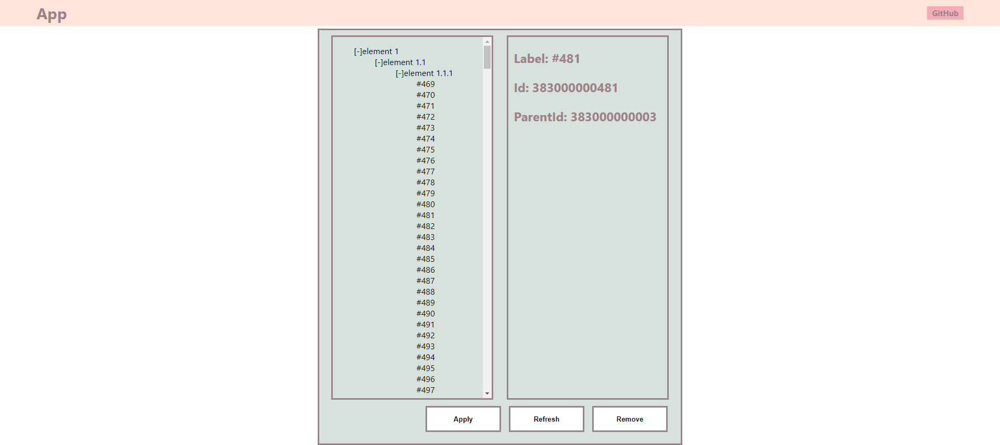

# Тестовая работа для компании `ОптимаКросс`.

Результат: [DEMO](https://webbomj.github.io/gist/)<br>



## Цель: 
### Задание 1
- [ ] Развернуть create-react-app<br>
- [ ] Сверстать макет [layout](layout.png)<br>
- [ ] Запросить данные из gist по ссылке: [https://api.github.com/gists/e1702c1ef26cddd006da989aa47d4f62]<br>
  - [ ] Данные так же можно посмотреть здесь: [https://gist.github.com/avydashenko/e1702c1ef26cddd006da989aa47d4f62]<br>
- [ ] Полученные данные вывести в виде древовидного списка<br>
- [ ] Выделение элемента в списке должно отображать дополнительную информацию об элементе в соседнем блоке<br>
- [ ] При нажатии кнопки refresh должен происходить повторный запрос данных и их вывод<br>
- [ ] При нажатии на кнопку remove должен удаляться выбранный элемент<br>
  - [ ] Если выбран корневой элемент, то должна удаляться вся ветка элементов<br>
### Задание 2
- [ ] Добавить dnd для элементов списка и возможность перетаскивать их между веток<br>
- [ ] Добавить кнопку apply по нажатию выводить в консоль текущее состояние дерева<br>

## Запуск
```bush
npm start - Для запуска локального сервера
npm run build - для создания билд версии
```

## Инструменты
1. NodeJS 16
2. NPM 4
3. ReactJs 18.1
4. Redux-toolkit 1.8.2
5. Typescript 4.7.3
6. react-dnd 16.0.1
